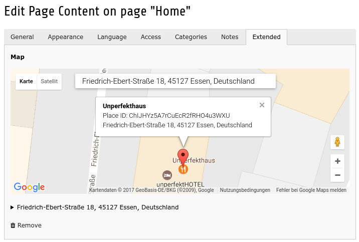
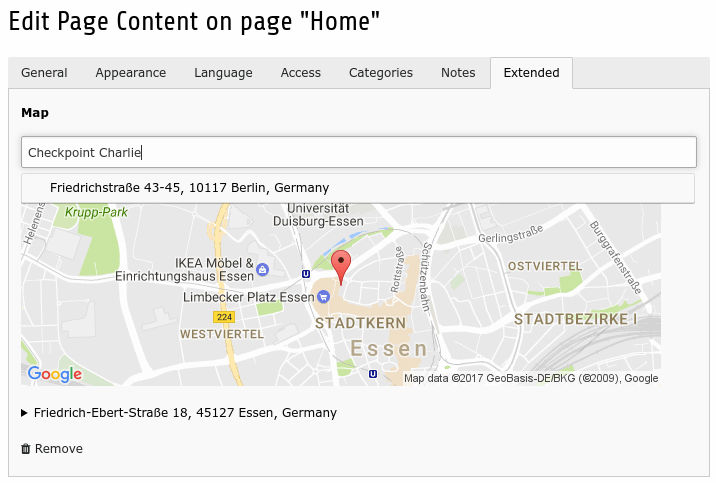
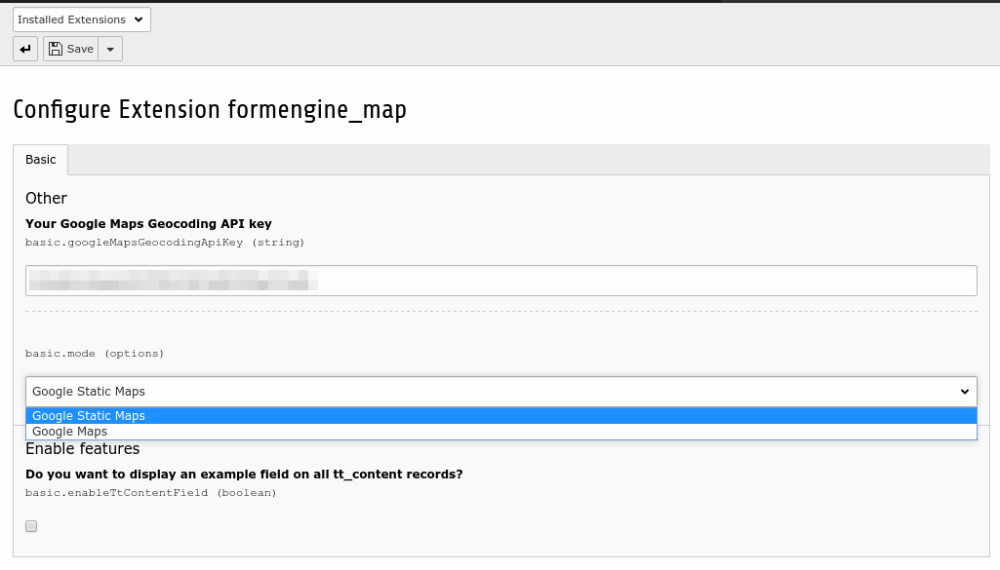

# TYPO3 CMS Formengine Map Node

A simplistic integration for Google Maps on any TCA `text` field.

It allows you to either leverage Google Static Maps for a very privacy protected API Access or Google Maps to search Places with a rich interface.

## Installation

```
composer require cedricziel/formengine-map
```

## Configuration

You need a Google Maps API key activated with the following APIs:

* [Google Maps Geocoding API](https://console.developers.google.com/apis/api/geocoding_backend/overview)
* [Google Maps JavaScript API](https://console.developers.google.com/apis/api/maps_backend/overview)

This key needs to be configured in the ExtensionManager.

The default configuration attaches a field of type `text` with `renderType=cz_map` to the `tt_content` TCA table.

```php
'tx_formmap_address' => [
    'exclude' => 0,
    'label'   => 'Map',
    'config'  => [
        'type'       => 'text',
        'renderType' => 'cz_map',
        'cols'       => 40,
        'rows'       => 15,
        'eval'       => 'trim',
        'size'       => 50,
    ],
],
```

Google Static Maps Embedded view:



Google Static Maps Embedded view:



ExtensionManager Configuration view:



## Usage on other tables / colums

Just define a text column with a `renderType` of `cz_map`. 

You can then use the included DataProcessor to transport the value to your view.

## ViewLayer

As the column is filled with a JSON blob, you need to deserialize it, before passing it to the view. You can do so (preferrably) in a DataProcessor, or use a ViewHelper to deserialize it in the view..

The extension ships a DataProcessor that attaches to `lib.fluidContent`, when the static template is included.

You can use the following snippet to attach it to any other element:

```typo3_typoscript
tt_content.my_ctype {
    dataProcessing {
        197 = CedricZiel\FormEngine\Map\DataProcessing\FormEngineMapProcessor
        197 {
            as = map
            field = tx_formmap_address
        }
    }
}
```

This will process the any given maps so that you can use the `map` variable in your fluid templates.

## License

GPLv2+
